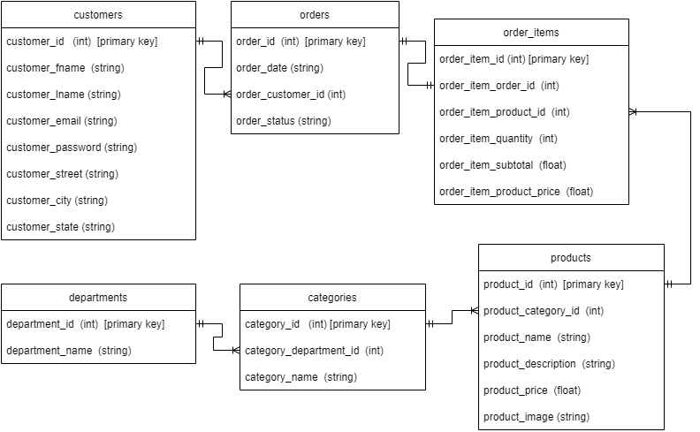
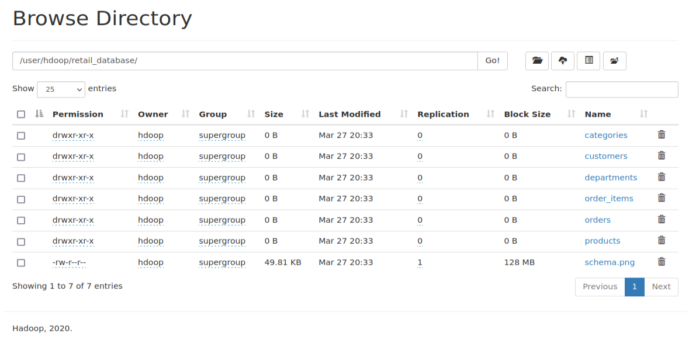
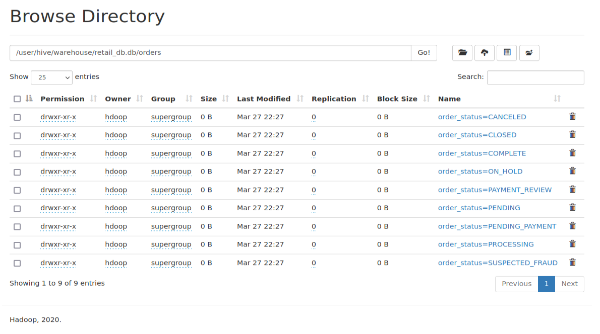
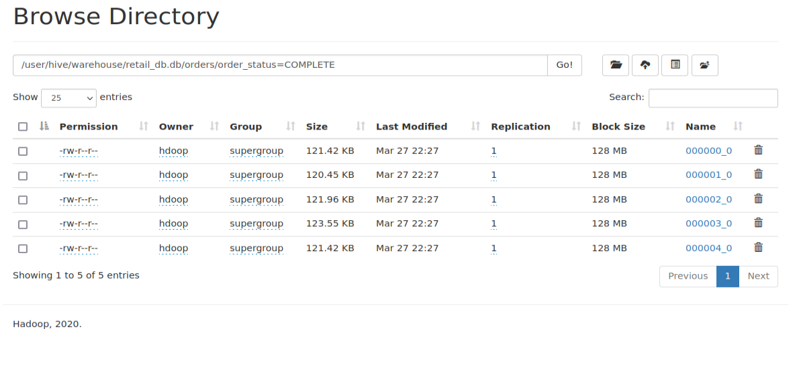
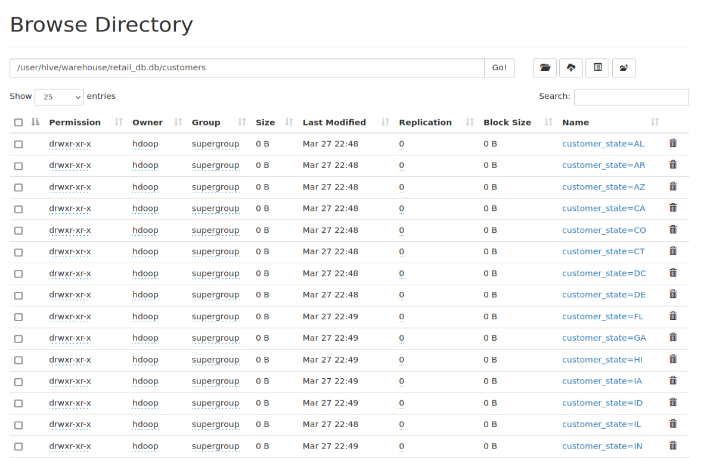
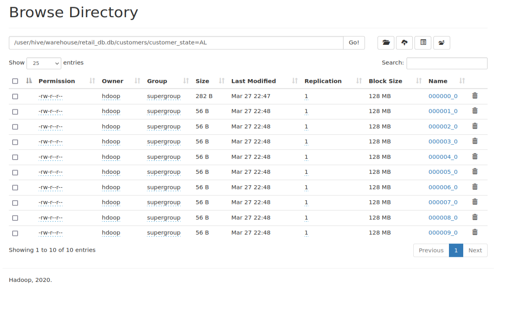
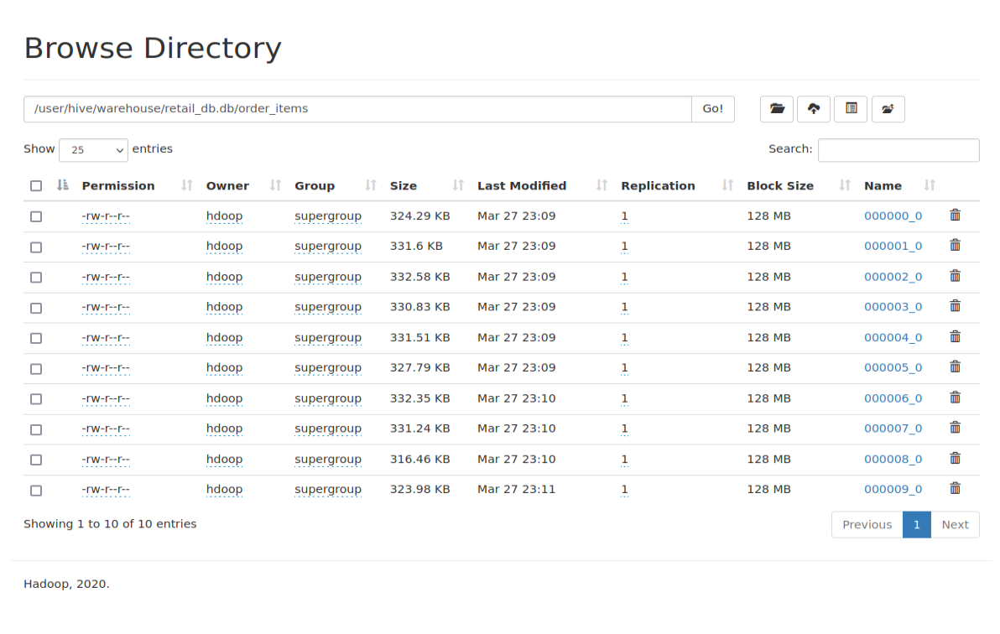
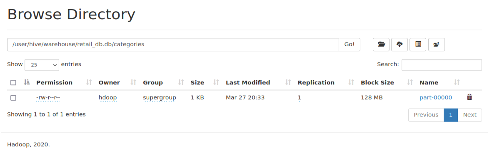
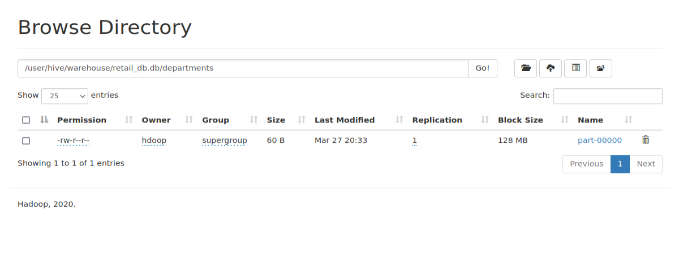
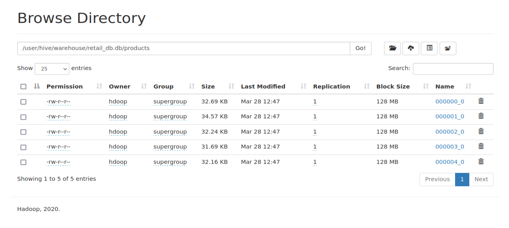

This project is about storing and analyzing the retail data set using Apache Hive. The Apache Hive data warehouse software facilitates reading, writing, and managing large datasets residing in distributed storage using SQL. Structure can be projected onto data already in storage. 

Pre-Requisites
====================
Apache Hadoop framework installed [ :superhero: Hadoop Installation Tutorial](https://github.com/akashpahilwan/Hadoop-Installtion-on-Linux) </br></br>
Apache Hive Installed  [ :superhero: Hive Installation Tutorial](https://github.com/akashpahilwan/Hive-Installtion-on-Linux) </br></br>

Data set Description 
====================

This datset contains multiple tables:
1. Orders Table
2. Customers Table
3. Order Items table
4. Categories Table
5. Departments table
6. Products table

You can download the retail_db  datset from retail_db-master folder or with the below link from Github:</br>
[Github Link Retail dataset](https://github.com/dgadiraju/retail_db) </br>


In this project We will build the data-warehouse in Hive and query the tables as per the requirements.</br>

Below is the Database Relationship Diagram for Retail database.
</br></br>

Step 1: Copying the data from Local Storage to HDFS
===================

We will be copying all the tables data INTO retail_database folder in HDFS

```
hadoop fs -ls retail_database/retail_database
```
We can see all the table folders has been copied to HDFS

</br></br>

Step 2: Creating database in Hive
=========================
Launch the hive shell with below command

NOTE: Hadoop must be installed and running below running the below commands.

```
hive
```
Create database retail_db and selecting it
```
Create database if not exists retail_db with DBPROPERTIES('created by'='Akash','created on'='2022-03-27');
use retail_db;
```
Step 3: Creating table in Hive
=========================
We want to perform analytics on our data and we want to store our data efficiently for that then we can use RCFILE format.

Orders Table
------------

Schema : order_id (int) , order_date (string) ,order_customer_id (int) ,order_status (string)

We will be partioning the table over order_status column and bucketing over order_id

Creating staging table for orders named orders_staging
```
create table orders_staging (order_id int, order_date string,order_customer_id int,order_status string) 
row format delimited fields terminated by ',' lines terminated by '\n'
TBLPROPERTIES('type'='staging table');
```
Load data from HDFS into staging table

```
load data inpath 'retail_database/orders/' INTO TABLE orders_staging;
```
Creating actual orders table with format as RCFILE
RC File format is optimized for querying the data from table
```
create table orders (order_id int, order_date string,order_customer_id int) 
PARTITIONED BY (order_status string)
CLUSTERED BY (order_id) INTO 5 BUCKETS 
row format delimited fields terminated by ',' lines terminated by '\n'
stored as RCFILE
TBLPROPERTIES('type'='Actual table');
```
We need to set dynamic partition properies in HIVE. Run bellow commands in hive shell
```
SET hive.exec.dynamic.partition=true;
SET hive.exec.dynamic.partition.mode=nonstrict;
```

Copying the data from staging table to actual table

```
INSERT OVERWRITE TABLE orders partition(order_status)
select order_id,order_date,order_customer_id,order_status from orders_staging;
```
Dropping the orders_stage table as it is not needed
```
drop table orders_stage;
```
Let us view how the orders table is stored in database. Each database will be created under '/user/hive/warehouse/' in HDFS. Each table will be created under the database selected.</br>

We have partitioned the table by Order_status. Hence we will be seeing distinct order_status subfolders under  orders table.

</br></br>

Further each partition is bucketed into 5 buckets. Opening sub_folder order_status=COMPLETE
</br></br>


Customers Table
--------------

Schema: customer_id (int), customer_fname (string), customer_lname (string), customer_email (string), customer_password (string), customer_street (string), customer_city (string), customer_state (string)

We will be partioning the table over customer_state column and bucketing over customer_city

Creating staging table for customers named customers_staging
```
create table customers_staging (customer_id int, customer_fname string,customer_lname string,customer_email string,customer_password string,customer_street string,customer_city string,customer_state string) 
row format delimited fields terminated by ',' lines terminated by '\n'
TBLPROPERTIES('type'='staging table');
```
Load data from HDFS into staging table

```
load data inpath 'retail_database/customers/' INTO TABLE customers_staging;
```
Creating actual customers table with format as RCFILE
RC File format is optimized for querying the data from table
```
create table customers (customer_id int, customer_fname string,customer_lname string,customer_email string,customer_password string,customer_street string,customer_city string)
PARTITIONED BY (customer_state string)
CLUSTERED BY (customer_city) INTO 10 BUCKETS 
row format delimited fields terminated by ',' lines terminated by '\n'
stored as RCFILE
TBLPROPERTIES('type'='Actual Customers table');
```
Copying the data from staging table to actual table

```
INSERT OVERWRITE TABLE customers partition(customer_state)
select customer_id,customer_fname,customer_lname,customer_email,customer_password,customer_street,customer_city,customer_state from customers_staging;
```
Dropping the orders_stage table as it is not needed
```
drop table customers_staging;
```
We have partitioned the table by customer_state. Hence we will be seeing distinct customer_state subfolders under  customers table.

</br></br>

Further each partition is bucketed into 10 buckets. Opening sub_folder customer_state=AL
</br></br>


Order Items Table
------------

Schema: order_item_id (int), order_item_order_id (int), order_item_product_id (int), order_item_quantity (int), order_item_subtotal (float) , order_item_product_price (float)

We will be bucketing table over order_item_id

Creating staging table for order items named order_items_staging
```
create table order_items_staging (order_item_id int, order_item_order_id int,order_item_product_id int,order_item_quantity int,order_item_subtotal float, order_item_product_price float)
row format delimited fields terminated by ',' lines terminated by '\n'
TBLPROPERTIES('type'='staging table');
```
Load data from HDFS into staging table

```
load data inpath 'retail_database/order_items/' INTO TABLE order_items_staging;
```
Creating actual order_items table with format as RCFILE
RC File format is optimized for querying the data from table

```
create table order_items (order_item_id int, order_item_order_id int,order_item_product_id int,order_item_quantity int,order_item_subtotal float, order_item_product_price float)
CLUSTERED BY (order_item_id) INTO 10 BUCKETS 
row format delimited fields terminated by ',' lines terminated by '\n'
stored as RCFILE
TBLPROPERTIES('type'='Actual Order Items table');
```
Copying the data from staging table to actual table

```
INSERT OVERWRITE TABLE order_items 
select order_item_id, order_item_order_id,order_item_product_id,order_item_quantity,order_item_subtotal, order_item_product_price from order_items_staging;
```
Dropping the order_items_staging table as it is not needed
```
drop table order_items_staging;
```

The table is bucketed into 10 buckets.
</br></br>


Categories Table
---------------

Schema: category_id (int), category_department_id (int), category_name (string)

We will be storing this table as TEXTFILE which is default format of HIVE tables.

As we will not be partitioning or bucketing this table there is no need of staging table. </br>

We will create actual table directly.
```
create table categories (category_id int, category_department_id int, category_name string)
row format delimited fields terminated by ',' lines terminated by '\n'
TBLPROPERTIES('type'='Actual categories table');
```
Load the data into categories table.

```
load data inpath 'retail_database/categories/' INTO TABLE categories;
```

Categories table doesnot have any partition or buckets.

</br></br>

Departments Table
-----------------

Schema: department_id (int), department_name (string)

We will be storing this table as TEXTFILE which is default format of HIVE tables.

As we will not be partitioning or bucketing this table there is no need of staging table. </br>

We will create actual table directly.
```
create table departments (department_id int, department_name string)
row format delimited fields terminated by ',' lines terminated by '\n'
TBLPROPERTIES('type'='Actual departments table');
```
Load the data into categories table.

```
load data inpath 'retail_database/departments/' INTO TABLE departments;
```
Departments table doesnot have any partition or buckets.

</br></br>


Products Table
----------------

Schema: product_id (int), product_category_id (int), product_name (string), product_description (string), product_price (float), product_image (string)

We will be storing this table as TEXTFILE which is default format of HIVE tables.

We will be bucketing this table by product_category_id </br>

Creating staging table for products named products_staging
```
create table products_staging (product_id int, product_category_id int,product_name string,product_description string,product_price float, product_image string)
row format delimited fields terminated by ',' lines terminated by '\n'
TBLPROPERTIES('type'='staging table');
```
Load data from HDFS into staging table

```
load data inpath 'retail_database/products/' INTO TABLE products_staging;
```
Creating actual products table with format as TEXTFILE
RC File format is optimized for querying the data from table

```
create table products (product_id int, product_category_id int,product_name string,product_description string,product_price float, product_image string)
CLUSTERED BY (product_category_id) INTO 5 BUCKETS 
row format delimited fields terminated by ',' lines terminated by '\n'
stored as RCFILE
TBLPROPERTIES('type'='Actual products table');
```
Copying the data from staging table to actual table.

```
INSERT OVERWRITE TABLE products 
select product_id, product_category_id,product_name,product_description,product_price,product_image from products_staging;
```
Dropping the products_staging table as it is not needed.
```
drop table products_staging;
```
The table is bucketed into 5 buckets.
</br></br>